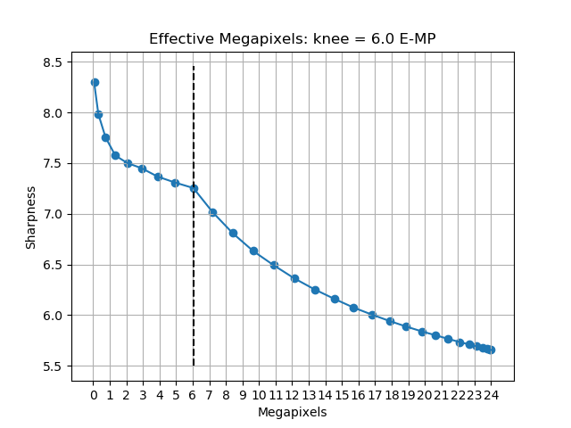
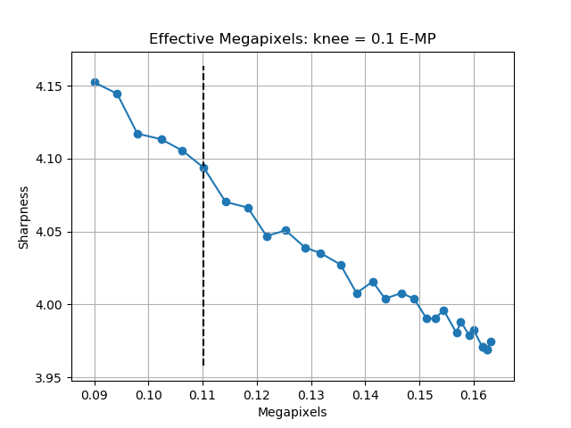

# Determining the Effective Resolution (E-MP) of a photograph

Every digital photograph has a resolution which is one measure of its quality, but a high resolution does not mean that the image itself is sharp. With a very sharp photo, zooming in on your monitor reveals more details and information of the photograph. However, some photos can be high resolution but do not yield any more details when zooming in than what you could already see zoomed out. Have you ever noticed when using a smartphone photo as a wallpaper for your computer, that it just doesn't look quite sharp? This isn't always due to image noise; it might just be that the effective resolution is not quite there. In general, camera sensors and lenses often do not have the capability to fill every single pixel on the sensor with contrastful information. When using an interchangeable lens camera, you might want to know how sharp some of your lenses at various apertures truly are. Whatever you need to know the actual resolution for, look no further!

With this script, the <i>effective</i> number of megapixels can be determined, in essence indicating that downsampling the image to this resolution should capture as much detail as is present the full-sized image.

This idea is similar to the '[Perceptual MegaPixel](https://en.wikipedia.org/wiki/Perceptual_MegaPixel)' (P-MP) of DxO Labs. Unfortunately, their measurements are proprietary and have never been made public, plus the name has been trademarked (hence my 'Effective Megapixels' instead). This repository aims to give the public an option to determine the effective megapixels of a camera + lens combination, where the measurement algorithm is clear as day.

## Running the code

The code can be run with the following:

`python compute_e-mp.py <path-to-image>`

Exactly one parameter is required, which is the relative or absolute path to an image supported by `Pillow` (`PIL`). See `requirements.txt` for the packages and versions that I've successfully run the code with.

## Important Notes

It may not be obvious, but **these results cannot be compared with the DxO P-Mpix scores** as this is a completely different and independent computation.

Before running the code, check out the variable settings in `config.py` and the comments above to find out what they do. If you are running this on an older machine, you might want to adjust some parameters to make it easier (yet more inaccurate) to run the code on larger images. The code works by checking sharpness for a user-defined number of downscaled versions. Make sure that the photo you are trying to use does not contain too much blur or bokeh.

This is a good example of what the plot should look like. There is a clear knee between where the sharpness is high due to having a very low resolution, and where the sharpness is lower due to sensor & lens imperfections. This knee indicates where the resolution is just right for the amount of detail in the image.

This is a bad example, because **(1)** the image is way too low in resolution, and **(2)** the graph does not look good. Make sure you set `SHOW_PLOT = True` in `config.py` if you want to make sure that the output makes sense.

## Quick Results

For each of the following results: `MIN_RESOLUTION_WIDTH = 200`; `NUM_DOWNSCALES = 20`; `DOWNSCALE_EXPONENTIALLY = True`.

| Device                            | Actual Resolution | Effective Resolution | # Samples |
| --------------------------------- | ----------------- | -------------------- | --------- |
| Google Pixel 3a                   | 12.2 MP           | **2.9 E-MP**         | *N=2*     |
| Sony A7C + Tamron 28-75mm @ f/2.8 | 24.0 MP           | **7.2 E-MP**         | *N=4*     |

## Improvements

There is no guarantee that an Effective Megapixel (E-MP) number is found for every photo you run this script on. In fact, this code can be quite prone to errors with finding the appropriate knee in the graph. This is why I strongly recommend checking out the plots resulting from the script, and comparing it to the good plot shown above. Use your common sense by comparing the E-MP to how you would rate the amount of detail in a photograph yourself, and if the curve looks very different than what you're used to, try running the script on a different image taken with the same camera + lens.

Furthermore, most likely, there are better algorithms to use to determine the overall sharpness of a (downscaled) image. Let me know if you have any improvements in mind.
